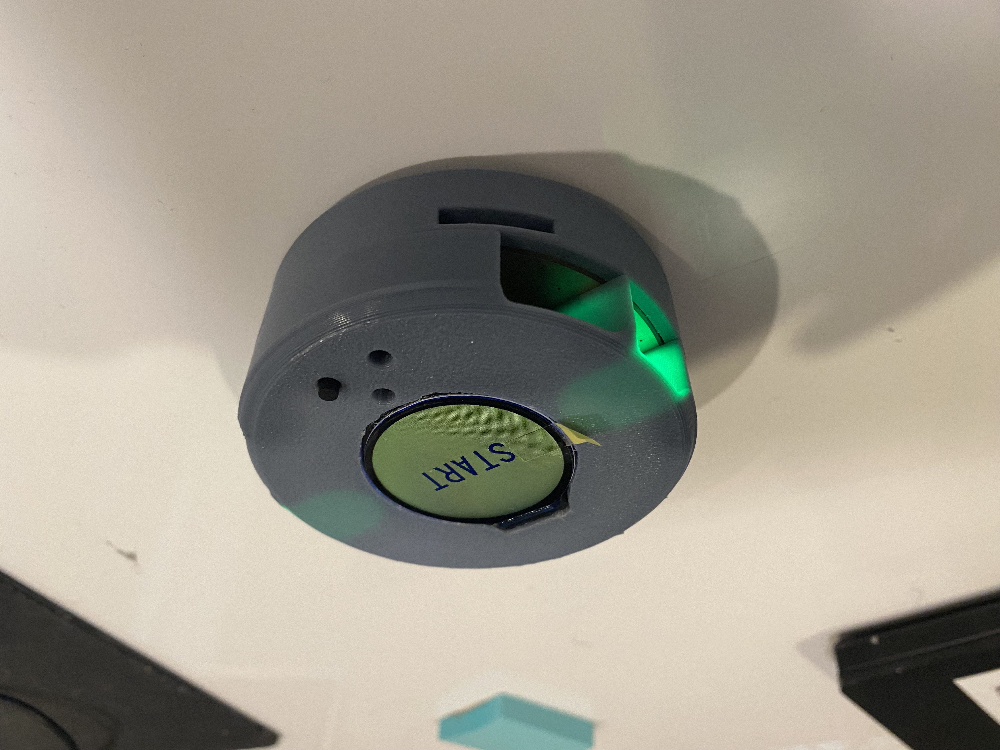
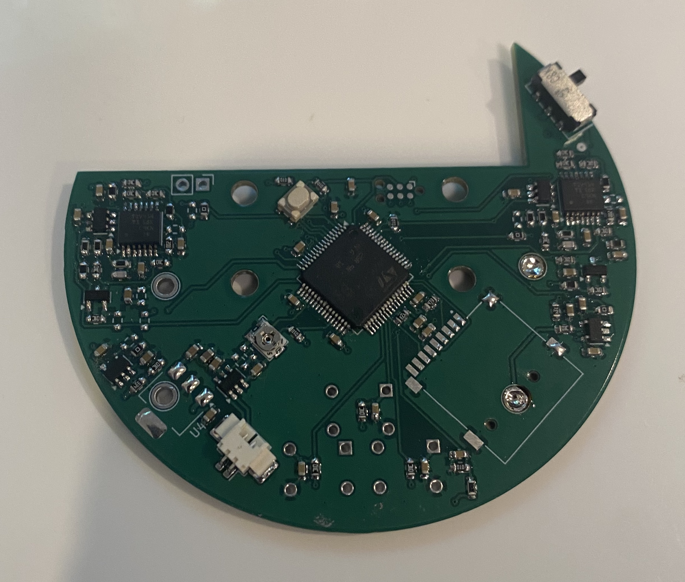
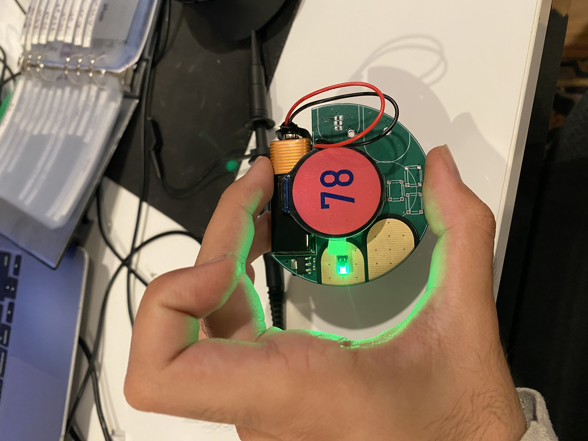
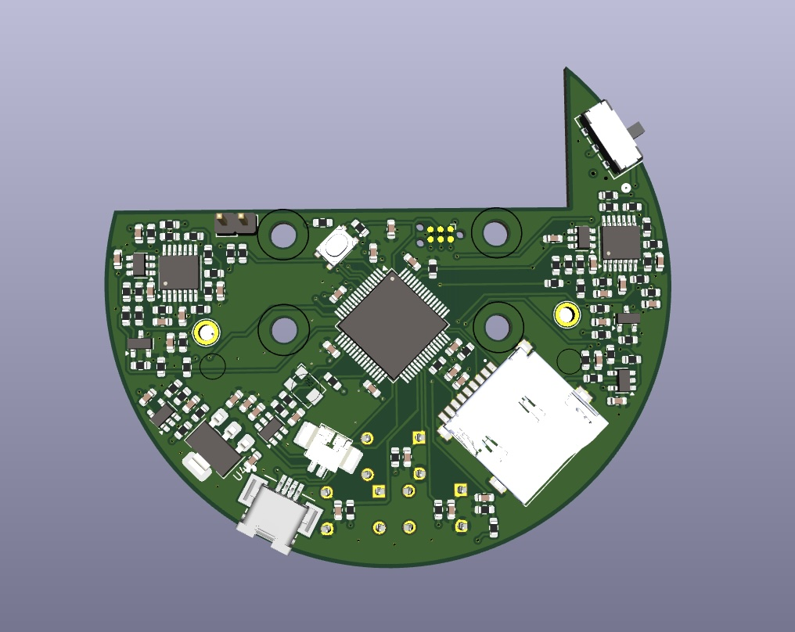
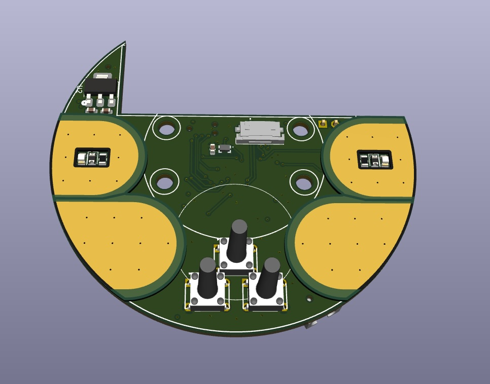
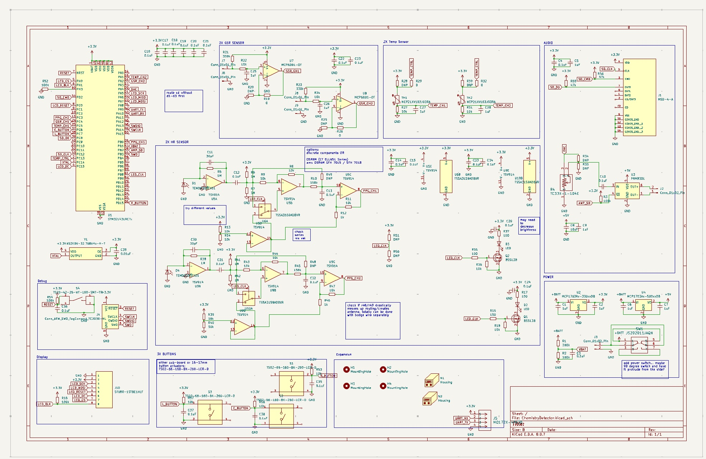

# 2-Person Polygraph Project

## Description

Starting out as a joke project to try and quantify compatibility of two people, this design evolved into an interesting engineering challenge. It uses custom PPG and GSR sensors and data analysis using Z-score normalization and dynamic time warping to quantify how similar two individuals' biological responses to external stimuli were. A handful of psychological studies have shown that similarity in scores has implications for higher trust levels.

AI was not used to generate code or PCB design for any aspect of this project; fully, 100% human!

Visual, algorithmic, and some electronics touches still to be completed. (As well as documentation here lol; this was done in a rush).

## Images

Completed-ish V1 in 3d-printed housing

PCB before being finished soldered.

Super early prototype

## Design Files

